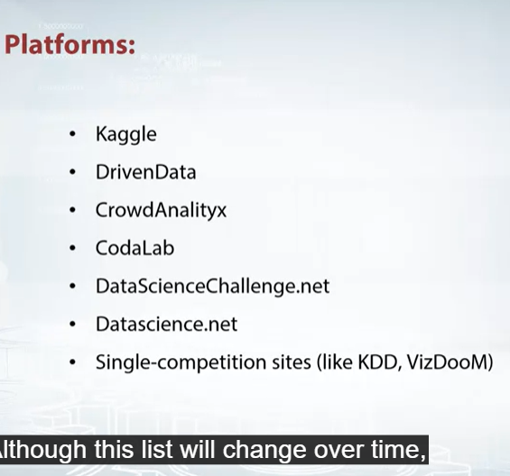

## Welcome

Gives information about the course

## Competition mechanics

1. Data
2. Model
3. Submission
4. Evalation
5. Leaderboard

It is okay for us to use real life mechanics

## Recap of main machinelearning algorithms

1. Linear regression - scikit learn and vowpal rabbit
2. Decision tree   - Geadient booseted and rnadom trees - scikit learn, microsoft lightbgm, dlmc xgboost
3. K nearest Neighbors algorithm - scikit learn
4. Neural network - Tensorflow, keras, dmlcmxnet, pytorch, lasagne
5. No free lunch theorem

# rest of the course is behind a paywall.
